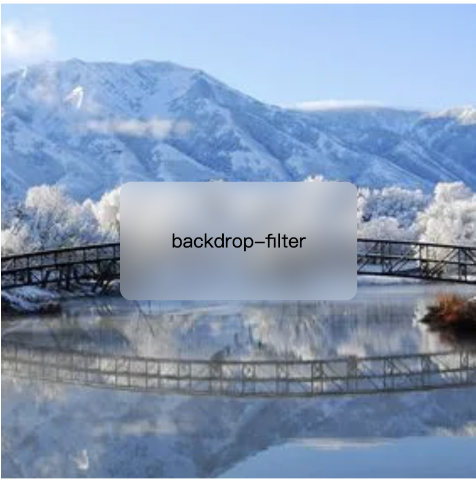
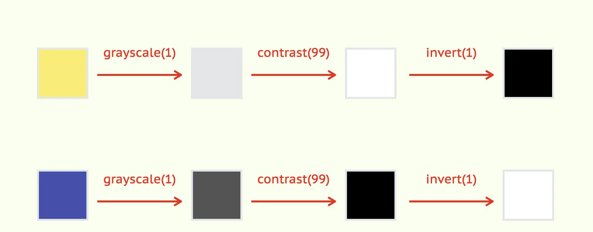

# css-demo

## css 学习 demo

html 中各个标签的含义：https://developer.mozilla.org/zh-CN/docs/Web/HTML/Element
css-demo
https://github.com/fukai03/css-demo

### CSS：

#### css 选择器

02.html

- https://juejin.cn/post/6844904002103050254

#### 设置盒子 or 图片的宽高比：[aspect-ratio](https://developer.mozilla.org/en-US/docs/Web/CSS/aspect-ratio)

#### 浮动：float：https://developer.mozilla.org/zh-CN/docs/Learn/CSS/CSS_layout/Floats

#### position: https://www.runoob.com/cssref/pr-class-position.html

#### flex 布局：

- 参考文档：
  - MDN：https://developer.mozilla.org/zh-CN/docs/Web/CSS/CSS_Flexible_Box_Layout/Basic_Concepts_of_Flexbox
  - 菜鸟：https://www.runoob.com/w3cnote/flex-grammar.html
  - 阮一峰：https://www.ruanyifeng.com/blog/2015/07/flex-grammar.html

```css
/*
容器属性：
flex-direction：主轴的方向（即项目的排列方向） row | row-reverse | column | column-reverse
flex-wrap：如果一条轴线排不下，如何换行。nowrap | wrap | wrap-reverse;
flex-flow：flex-direction属性和flex-wrap属性的简写形式，默认值为row nowrap。
justify-content：主轴上的对齐方式。flex-start | flex-end | center | space-between | space-around;
align-items：在交叉轴上如何对齐。flex-start | flex-end | center | baseline | stretch
align-content：多根轴线的对齐方式。如果项目只有一根轴线，该属性不起作用
*/
/*
item属性：
order：定义项目的排列顺序。数值越小，排列越靠前，默认为0。
flex-grow：定义项目的放大比例，默认为0，即如果存在剩余空间，也不放大。
           如果所有项目的flex-grow属性都为1，则它们将等分剩余空间（如果有的话）。
           如果一个项目的flex-grow属性为2，其他项目都为1，则前者占据的剩余空间将比其他项多一倍。
flex-shrink：定义了项目的缩小比例，默认为1，即如果空间不足，该项目将缩小。如果所有项目的flex-shrink属性都为1，
            当空间不足时，都将等比例缩小。如果一个项目的flex-shrink属性为0，其他项目都为1，则空间不足时，前者不缩小。
flex-basis：flex-basis属性定义了在分配多余空间之前，项目占据的主轴空间（main size）。<length> | auto; /* default auto */
            可以设为跟width或height属性一样的值（比如350px），则项目将占据固定空间
flex：flex-grow, flex-shrink 和 flex-basis的简写，默认值为0 1 auto。后两个属性可选。
      两个快捷值：auto (1 1 auto) 和 none (0 0 auto)。
align-self：align-self属性允许单个项目有与其他项目不一样的对齐方式，可覆盖align-items属性。
            默认值为auto，表示继承父元素的align-items属性，如果没有父元素，则等同于stretch。
            auto | flex-start | flex-end | center | baseline | stretch;
*/
```

#### 文字属性：

- 控制文字最多显示两行

```css
overflow: hidden;
text-overflow: ellipsis; /* 超出部分省略号 */
word-break: break-all; /* break-all(允许在单词内换行。) */
display: -webkit-box; /* 对象作为伸缩盒子模型显示 */
-webkit-box-orient: vertical; /* 设置或检索伸缩盒对象的子元素的排列方式 */
-webkit-line-clamp: 2; /* 显示的行数 */
max-height: 80rpx; /* 设置最大高度，根据行高，要几行乘以几倍 */
```

#### 自适应布局

- 场景：一个固定高度的容器，内部竖直排列两个容器，顶部容器高度可变化，底部容器充满剩余空间（使用 flex）

```html
<div class="parent">
  <div class="child1"></div>
  <div class="child2"></div>
</div>
```

```less
// less样式
.parent {
  width: 100%;
  height: 400px;
  display: flex;
  flex-direction: column;
  // flex-grow,flex-shrink默认为0，代表不放大也不缩小
  .child2 {
    flex-grow: 1;
    flex-shrink: 1;
  }
}
```

#### 瀑布流布局

- 参考 1：https://juejin.cn/post/6994060732107063332
- 使用 grid 布局

```less
.container {
  display: grid;
  grid-template-columns: repeat(4, 1fr);
  grip-gap: 10px;
  grid-template-rows: masonry; // 关键，改属性目前只有火狐兼容
}
```

#### Grid 网格布局

参考文档：

- 阮一峰博客
- MDN
  grid 与 flex 布局区别：flex 基于轴线布局，只能指定 item 针对轴线的布局，可看做一维布局，grid 布局则将容器划分为行和列

#### 伪元素

MDN：https://developer.mozilla.org/zh-CN/docs/Web/CSS/Pseudo-elements

#### input

- 去掉点击时出现的边框

```html
// html
<input
  placeholder="请输入标题"
  v-model="title"
  class="title"
  @blur="titleChange"
/>
```

```less
// less
.title {
  width: 100%;
  height: 50px;
  border: none;
  font-size: 30px;
  color: #ccc;
  &::placeholder {
    // 设置placeholder文字样式
    font-size: 30px;
  }
  &:focus {
    outline: none; // 去除点击时的边框
  }
}
```

#### 页面整体变灰：

找到 html 节点设置[filter](https://developer.mozilla.org/zh-CN/docs/Web/CSS/filter)属性
filter: grayscale(0.9);

#### 有序列表和无序列表（ul，ol 样式失效时可进行如下样式定义，也可用于 div 等元素）

```less
ul,
ol {
  margin: 10px 0 10px 10px;
}
ul {
  li:before {
    content: counter(sub-item, disc);
    margin-right: 3px;
  }
}
ol {
  li {
    counter-increment: mycounter;
  }
  li:before {
    content: counter(mycounter, decimal) ".";
    margin-right: 3px;
  }
}
```

#### backdrop-filter

01.html

- backdrop-filter 可以为一个元素后面区域添加图形效果（如模糊或颜色偏移）。因为它适用于元素背后的所有元素，为了看到效果，必须使元素或其背景至少部分透明。
- blur 添加模糊

```html
<!-- html  -->
<div class="box1">
  <div class="text1">backdrop-filter</div>
</div>
```

```css
/* css */
.box1 {
  width: 400px;
  height: 400px;
  background-image: url("./assets/image1.png");
  background-repeat: no-repeat;
  background-position: center;
  background-size: cover;
  display: flex;
  align-items: center;
  justify-content: center;
}
.text1 {
  width: 200px;
  height: 100px;
  background: rgba(255, 255, 255, 0.3);
  text-align: center;
  line-height: 100px;
  backdrop-filter: blur(10px);
  border-radius: 10px;
}
```


```html
<!-- html  -->
<div class="box1 box2">
  
</div>
```

```css
/* css */
.box1 {
  width: 400px;
  height: 400px;
  background-image: url("./assets/image1.png");
  background-repeat: no-repeat;
  background-position: center;
  background-size: cover;
  display: flex;
  align-items: center;
  justify-content: center;
}
.box2 img {
  width: 300px;
  z-index: 1;
}
.box2 {
  position: relative;
}
.box2::after {
  backdrop-filter: blur(10px);
  content: "";
  width: 100%;
  height: 100%;
  display: block;
  position: absolute;
  z-index: 0;
}
```


#### css 变量

03.html

- https://developer.mozilla.org/zh-CN/docs/Web/CSS/var

```html
<!DOCTYPE html>
<html lang="en">
  <head>
    <meta charset="UTF-8" />
    <meta http-equiv="X-UA-Compatible" content="IE=edge" />
    <meta name="viewport" content="width=device-width, initial-scale=1.0" />
    <title>css变量</title>
  </head>
  <body>
    <h1>css变量</h1>

    <div class="container" style="--primary-font: 'Courier New'">
      <h1>scope variate</h1>
    </div>
    <h1>after container</h1>
    <button onclick="changeVar()">changeVar</button>
    <style>
      :root {
        --primary-color: red;
      }
      .container {
        --primary-color: blue;
        font-family: var(--primary-font);
      }
      h1 {
        color: var(--primary-color);
      }
    </style>

    <script>
      function changeVar() {
        const el = document.getElementsByClassName("container");
        console.log(el);
        el[0].style.setProperty("--primary-color", "green");
      }
    </script>
  </body>
</html>
```

#### 使用 css 实现节流

04.html

```html
<h1>使用css实现函数节流</h1>
<button class="throttle" onclick="console.log('点击')">点击</button>
```

```css
body {
  display: grid;
  place-content: center;
  height: 100vh;
  margin: 0;
  gap: 15px;
  background: #f1f1f1;
  user-select: none;
}
button {
  user-select: none;
}
.throttle {
  animation: throttle 1s step-end forwards;
}
.throttle:active {
  animation: none;
}
@keyframes throttle {
  from {
    pointer-events: none;
    opacity: 0.65;
  }
  to {
    pointer-events: all;
    opacity: 1;
  }
}
```

#### css 空格问题

- 设置 css 属性 [white-space](https://developer.mozilla.org/zh-CN/docs/Web/CSS/white-space)
- 若需保留空格（不合并空格），可使用 `<pre></pre>` 标签包裹。
#### 使用 filter 属性实现文字与背景保持高对比度（文字黑白变换）
05.html
```html
<body>
    <div class="box">
    <span class="txt">前端侦探</span>
    </div>
    <input type="color" onchange="document.getElementById('box').style.color = this.value">
</body>
<style>
     .box {
        display: grid;
        place-content: center;
        width: 300px;
        height: 150px;
        font-size: 32px;
        color: #ffeb3b;
        background-color: currentColor;
     }
    .txt{
       filter: grayscale(1) contrast(9999) invert(1);
    }
</style>
```

原理：

